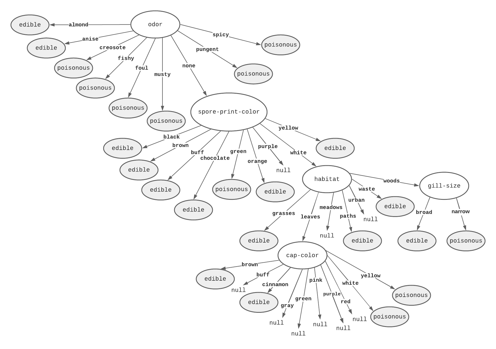

# Mushroom Decision Tree

> Pràctica de Haskell de Llenguatges de programació (edició tardor 2020).

## Table of Contents

* [Description](#description)
    * [Decision Tree](#decision-tree)
    * [Classification](#classification)
* [Usage](#usage)
* [References](#references)
* [Author Info](#author-info)


## Description

Aquest programa permet construir un arbre de decisió (*decision tree*) per discernir si un bolet és comestible (*edible*) o verinós (*poisonous*). Tot això a partir de processar un conjunt de dades d'atributs de bolets `agaricus-lepiota.data`, obtingut d'aquesta [font](https://archive.ics.uci.edu/ml/datasets/Mushroom).  

El programa consta de dos blocs:
* Arbre de decisió 

* Classificació  

### Decision Tree
Un **arbre de decisió** es un model per clasificar les dades de forma eficaç. És desitjable crear l'arbre el més petit possible per representar una gran mostra de dades.

En aquesta pràctica està implementada l'algorisme d'arbres de decisió **ID3** en Haskell. Es un dels més fàcils d'implementar i produeix resultats útils. Es tracte d'un algorisme que utilitza el concepte d'entropia de Shannon per dividir un conjunt de mostres per l'atribut que maximitza el guany d'informació. Aquest procés es repeteix recursivament fins que estem tractant amb mostres de la mateixa classifiació o quan ens quedem sense atributs.

Al executar el programa s'observarà l'arbre resultant espaiat per nivells. Per si fos necessari, a continuació trobem l'arbre resultant amb més claredat.  

<p align="center">
    
</p>

### Classification
Després de que es mostri l'arbre de decisió resultant. Apareixerà un procés de classificació que funciona a partir d'un sistema de diàleg que va recorrent l'arbre i et donarà una predicció si el bolet és comestible (*edible*) o no (*poisonous*). Cal remarcar que l'arbre pot tenir valors `null` que vindria a dir que no hi ha cap bolet amb aquelles característiques.

## Usage
Per executar el programa és tan fàcil com posar:

```sh
ghc dts.hs
```
i a continuació:
```sh
./dts
```

## References

* Gerard Escudero, 2020. [*Machine Learning*](https://gebakx.github.io/ml/#1)

* Jeff Schlimmer, 1981. [*Mushroom Data Set*](https://archive.ics.uci.edu/ml/datasets/Mushroom). [UCI Machine Learning Repository](https://archive.ics.uci.edu/ml/index.php).

## Author Info

* Nom: Albert Ibars Cubel

* Correu: albert.ibars.cubel@estudiantat.upc.edu


